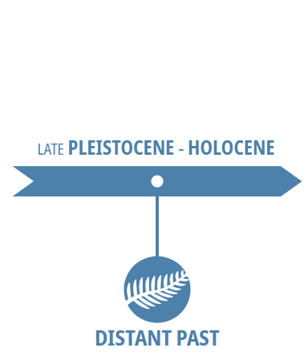
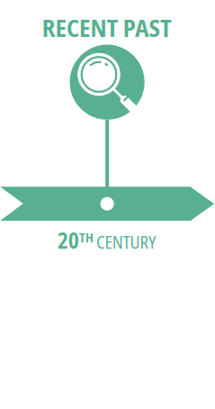
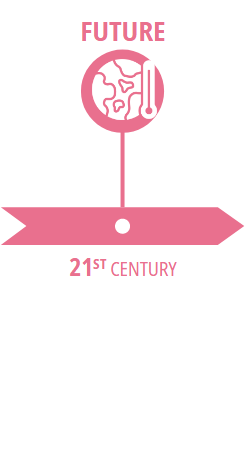

 

\
\

**This repositery contains most of the code and documents used during my PhD.** \
\
Note it might be a bit messy, as I have been carrying on this project for 3 years.\
It reflects my thoughts, my many tests and failures!
\
\
\
For a cleaner version, please look at each specific GitHub repo (created and cleaned to ensure each chapter/paper is fully reproducible), by clicking on one section of the timeline:

   

Or by following one of this link:
- [inverse calibration method](https://github.com/vvandermeersch/inverse_calibration)
- [hindcasting performance](https://github.com/vvandermeersch/past_robustness)
- [improving models](https://github.com/vvandermeersch/contrast_calibrations)
- [future uncertainties](https://github.com/vvandermeersch/contrast_calibrations)

\
\
Feel free to contact me for details !  
:email: *victor.vandermeersch@cefe.cnrs.fr* \
:email: *victor.vandermeersch@ubc.ca* \
:email: *victor.vandermeersch@posteo.org*

