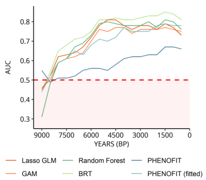

#### How to measure performance againt novelty/extrapolation ?

* Maguire et al. (2016), Fitzpatrick et al. (2018): continuous manner (climatic distance)  
   *=> How should we measure this distance, as SDM and PBM differ? Using SDM predictors?*
   
* Qiao et al. (2018): categorical approach: overlapping (interpolation), novel-combination, and novel  
   *=> Same question as above: with which variable should we define the multi-dimensional environmental space?*
     
* Elith and Graham (2009), Qiao et al. (2018) : interpolation/extrapolation along environmental gradients (response curves)  
   *=> Is this approach applicable/relevant with PBM? How could we draw a PBM response curve against the same predictor gradient as a SDM ?*
   
