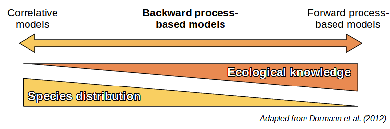
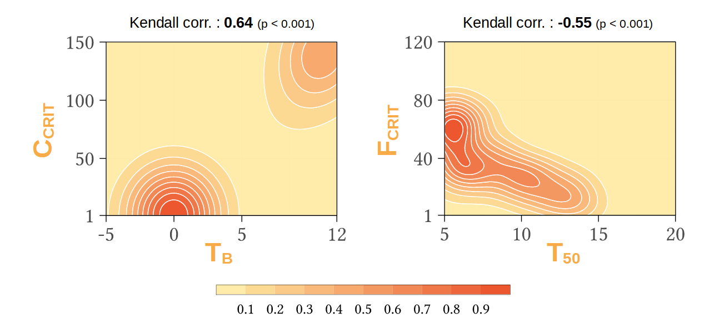

  
```{r setup, include=FALSE}
knitr::opts_chunk$set(echo = FALSE)  # Hide code by default. Can override chunk-by-chunk
```


# {.col-2}
<!-- Span the first column for four rows, that way we can capture the usage block, two rows of template examples, and refs/footer information -->
  
  
## 1. Introduction 
  
* Two types of species distribution models (SDMs): **correlative niche-based models** and **process-based models**[@dormann]
* Process-based models: translate **physiological and ecological processes** into **mathematical equations**
* Take more time to develop, **calibration** is **challenging** and **time-consuming** 

* Exploration of the feasibility of **Calibrating process-based models using species occurrence data** as correlative SDMs, i.e. **backward calibration**
  
  
## 3. Covariance matrix adaptation, evolution strategy {.color2}
  
### CMA-ES in a nutshell
* Robust optimization algorithm for **non-linear optimization problems** in continuous domain developped by **Nikolaus Hansen**[@cmaes]
* Inspired by **evolutionary biology**: recombination, mutation and selection


### In practice
* **Parallel implementation** on two computing clusters (40 to 100 CPUs)
<br> <br>
* Runtime :
  * PHENOFIT: ~ 24 hours
  * CASTANEA: ~ 20 days

# {.col-2}

## 2. Data and models {.color2}

### Tree occurrence data

* **EU-Forest** dataset
* Completed with records from **GBIF**, filtered with **Atlas Flora Europeae** and **EuroVegMap** species ranges
* For *Quercus ilex*, added records from **WOODIV** database

### Climate and soil data

* Climatic variables were derived from **ERA5-Land** (1970-2000), 0.1° resolution
* Soil variables were extracted from **EU-SoilHydroGrids** and **SoilGrids250m**
  
### {.fullwidth}
  
  

<figcaption class = "caption">
<b>Fig. 3: Species distribution</b>
</figcaption>
  
  
### Process-based models {.fullwidth}
  
* **PHENOFIT**[@phenofit]: focuses on phenology and simulates the fitness (survival and reproductive success) of an average individual
* **CASTANEA**[@castanea]: simulates carbon and water fluxes in forest, with several processes (photosynthesis, stomatal conductance, respiration...)


# {.col-1}

## 4. Calibration results 

### {.fullwidth}


<figcaption class = "caption">
<b>Fig. 4: Species distribution maps obtained with PHENOFIT and CASTANEA forward and backward parametrization. Optimal threshold to dichotomize model outputs is the Youden Index-based cut-off point.</b>
</figcaption>
  
# {.col-2}
  
## 5. Non-identifiability of parameters
  
* Focus on the leaf unfolding submodel in PHENOFIT: **high variability in the parameter estimates**
{ width=100% }
<figcaption class = "caption">
<b>Fig. 2: Leaf unfolding submodel parameter density, after 100 calibrations with F. sylvatica</b>
</figcaption>
<br>
* Parameters are strongly dependent because of **structural correlations**. Thus, parameter values are **not necessarily ecologically relevant**
  
## References {.theme-minimalist}
  
<div id="refs" class="references"></div>
  

  
# {.col-2}
  
## 6. Advantages of CMA-ES {.color2}
  
### Comparison with ABC
CMA-ES slighty **outperforms** approximate bayesian computation (ABC)
<figure>

<figcaption class = "caption">
<b>Fig. 5: Comparison of CMA-ES (red) and ABC-rejection (orange) methods, with F. sylvatica</b>
</figcaption>
</figure>
  
  
### Calibration performance
* AUC is **sharply improved** compared to classical (forward) parametrization
<br> <br>
* **Easy to use**: does not require an extensive tuning
<br> <br>
* Efficient to deal with **ill-conditioned and non-separable problems**
<br> <br>
* CMA-ES backward optimization can be a **powerful technique** to calibrate submodels whose parameter values can hardly be experimentally measured

